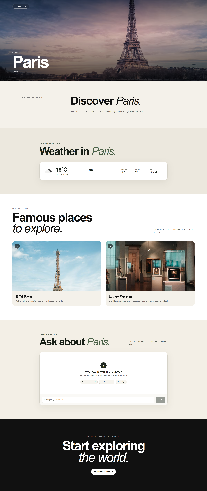
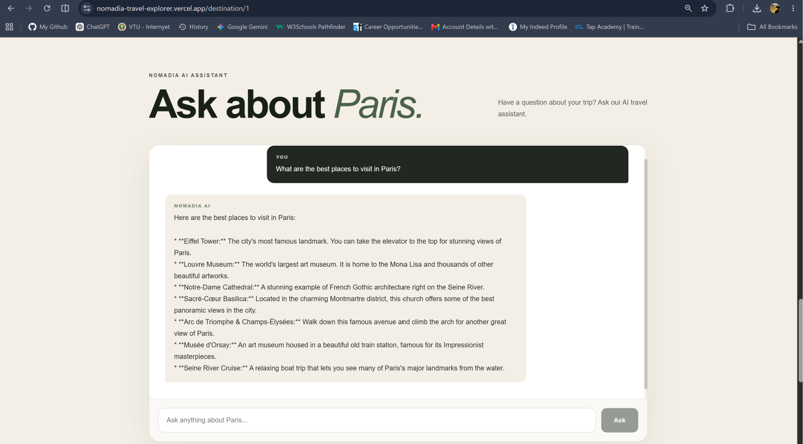
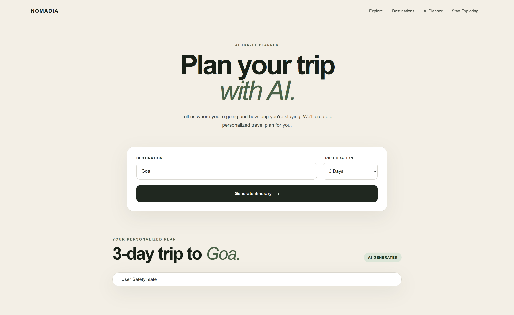

# 🌍 NOMADIA — Travel Explorer

> Discover remarkable places, explore destinations, check real-time weather, and create personalized travel itineraries with AI.

NOMADIA is a modern React-based travel exploration web application designed to help users discover destinations, explore famous places, view current weather conditions, detect their location, and generate AI-powered travel itineraries.

## 🚀 Live Demo

[View NOMADIA Live](YOUR_VERCEL_URL_HERE)

## 📂 GitHub Repository

[View Source Code](YOUR_GITHUB_REPOSITORY_URL_HERE)

---
## 📸 Screenshots

### Home & Hero


### Destination Details & Weather



### Famous Places



### AI Travel Planner



---

## ✨ Features

### 🔎 Destination Explorer

- Search destinations by name or country.
- Explore curated travel destinations.
- Filter destinations by region.
- Navigate to dedicated destination detail pages.

### 🗺️ Destination Details

Each destination provides:

- Destination overview
- Country and region information
- Destination imagery
- Famous places to visit
- Descriptions of popular attractions
- Current weather information

### 🌦️ Real-Time Weather

NOMADIA integrates real-time weather information using the OpenWeather API.

Weather information includes:

- Current temperature
- Weather condition
- Feels-like temperature
- Humidity
- Wind speed
- Weather icon

### 📍 Location Awareness

Users can allow NOMADIA to access their current location.

The application:

1. Requests browser location permission.
2. Retrieves the user's latitude and longitude.
3. Identifies the approximate location.
4. Fetches current weather conditions.
5. Displays the detected location and weather.

Users can also manually search for destinations if they prefer not to share their location.

### 🏛️ Famous Places

Destination pages include curated famous places with:

- Place images
- Place names
- Short descriptions
- Numbered visual cards

### 🤖 AI Travel Planner

The AI Travel Planner allows users to enter:

- Destination
- Trip duration

The application then generates a structured day-by-day itinerary.

The itinerary includes:

- Morning activities
- Afternoon activities
- Evening activities
- Practical travel tips

AI-generated content is rendered using Markdown for improved readability.

### 💬 AI Destination Assistant

NOMADIA also includes an AI-powered destination assistant that helps users ask questions about destinations and travel planning.

### 🎥 Immersive Hero Section

The landing page includes a looping travel background video with:

- Responsive layout
- Search interaction
- Location detection
- Clear call-to-action elements
- Overlay content for readability

### 📱 Responsive Design

The interface is designed to work across:

- Desktop
- Laptop
- Tablet
- Mobile devices

Responsive layouts, typography, spacing, cards, navigation, forms, and itinerary content adapt to different screen sizes.

### ⚠️ Loading & Error States

The application includes user feedback for:

- Weather loading
- AI itinerary generation
- Location detection
- API errors
- Invalid destination searches
- Missing AI responses

---

## 🛠️ Technologies Used

### Frontend

- React
- JavaScript
- HTML5
- CSS3
- React Router
- React Markdown
- Vite

### APIs & Services

- OpenWeather API — real-time weather data
- OpenRouter API — AI-powered travel planning and destination assistance
- Browser Geolocation API — user location detection
- OpenStreetMap Nominatim — reverse geocoding

### Development Tools

- Visual Studio Code
- Git
- GitHub
- Vercel
- npm

---

## 🏗️ Project Structure

```text
travel-explorer/
│
├── public/
│   ├── favicon.svg
│   ├── icons.svg
│   └── travel-video.mp4
│
├── src/
│   │
│   ├── components/
│   │   ├── DestinationCard.jsx
│   │   ├── DestinationChatbot.jsx
│   │   ├── Footer.jsx
│   │   ├── Hero.jsx
│   │   └── Navbar.jsx
│   │
│   ├── data/
│   │   └── destinations.js
│   │
│   ├── pages/
│   │   ├── AIPlanner.jsx
│   │   ├── DestinationDetails.jsx
│   │   ├── Explore.jsx
│   │   └── Home.jsx
│   │
│   ├── services/
│   │   ├── aiService.js
│   │   ├── locationService.js
│   │   └── weatherService.js
│   │
│   ├── App.jsx
│   ├── index.css
│   └── main.jsx
│
├── .gitignore
├── eslint.config.js
├── index.html
├── package.json
├── package-lock.json
├── vite.config.js
└── README.md